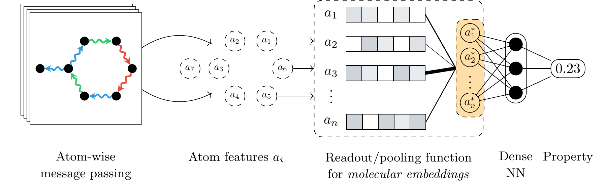

# Modelling local and general quantum mechanical properties with attention-based pooling



# General
This repository contains the source code accompanying the paper **Modelling local and general quantum mechanical properties with attention-based pooling**. It can be used to run all the experiments presented in the paper. It also includes all the random seeds and settings required for reproducibility.

# Abstract
Atom-centred neural networks represent the state-of-the-art for approximating the quantum chemical properties of molecules, such as internal energies. While the design of machine learning architectures that respect chemical principles has continued to advance, the final atom pooling operation that is necessary to convert from atomic- to molecular-representations in most models remains relatively undeveloped. The most common choices, sum and average pooling, compute molecular representations that are naturally a good fit for many physical properties, while satisfying properties such as permutation invariance which are desirable from a geometric deep learning perspective. However, there are growing concerns that such simplistic functions might have limited representational power, while also being suboptimal for physical properties that are highly localised or intensive. Based on recent advances in graph representation learning, we investigate the use of a learnable pooling function that leverages an attention mechanism to model interactions between atom representations. The proposed pooling operation is a drop-in replacement requiring no changes to any of the other architectural components. Using SchNet and DimeNet++ as starting models, we demonstrate consistent uplifts in performance compared to sum pooling and a recent physics-aware pooling operation designed specifically for orbital energies, on several datasets, properties, and levels of theory. The uplifts range from 3\% to 70\% depending on the specific task.

# A note on data
The QM7 and QM8 datasets with the associated 3D molecular information can be difficult to find and assemble, so we store the 3D versions in PyTorch Geometric format in this repository. The QMugs dataset also requires some pre-processing in order to associate the 3D information with the target properties. However, due to its large size (slightly under 2GB), we provide a [separate link to OneDrive](https://1drv.ms/u/s!AuMdLzIeQn-Xhf40TW3BR3_50npbVg?e=1oNvYT). The QM9 and MD17 can be downloaded and stored directly from PyTorch Geometric. OE62 is also relatively large and we do not store it in our repository. However, it can be downloaded from [the repository of Chen et. al](https://gitlab.mpcdf.mpg.de/kchen/localized-intensive-property-prediciton/-/tree/main/).

All the used data splits are available in the loading code specific to each dataset.

# Running the experiments
The provided code covers three different models/scenarios, as discussed in the paper:
1. SchNet, based on the implementation available in PyTorch Geometric (PyG)
2. DimeNet++, based on the implementation available in PyTorch Geometric (PyG)
3. SchNet, based on the `schnetpack 1.0.1` implementation. This is only used for the OE62 experiments, which are in turn based on the code provided by Chen et al. (see below for citation and link).

## SchNet (PyG)
The relevant code is available in the `SchNet_general` directory. The only file required for training is `train.py`. The code is designed to be used with the following datasets: QM7, QM8, QM9, QMugs, and the CCSD(T) and CCSD MD17 datasets (benzene, aspirin, malonaldehyde, ethanol, toluene). Ready-for-training versions of QM7 and QM8 are stored in this dataset, with QMugs available separately due to its size (see *A note on data* above). The QM9 and MD17 datasets are downloaded and stored through PyG.

The training code can be invoked through a command like the following:

```
python SchNet_general/train.py --dataset QM7 --readout sum --lr 0.0001
--batch-size 128 --use-cuda --random-seed 23887 --target-id 2 --schnet-hidden-channels 256
--schnet-num-filters 256 --schnet-num-interactions 8 --out-dir schnet_out_qm7
```
The options are defined as follows:
+ `readout <str>` -- The dataset to use. Possible values are: QM7, QM8, QM9, QMugs, and benzene, aspirin, malonaldehyde, ethanol, toluene
+ `readout <str>` -- defines the type of readout function. Possible values are `sum` and `set_transformer`
+ `lr <float>` -- learning rate
+ `batch-size <int>` -- batch size
+ `--use-cuda` -- boolean flag that indicates that CUDA (GPU training) should be used (`--no-use-cuda` to disable)
+ `--random-seed <int>` -- an integer random seed for the data split. The value must match those provided in the source code (the matching dataset file in the `data_loading` directory)
+ `--target-id <int>` -- the integer index of the target property to train against (HOMO, LUMO, etc.). The map between indices and properties is provided in the matching dataset file in the `data_loading` directory
+ `--out-dir <str>` -- The out/save directory (for checkpoints and saved outputs and metrics)
+ `--schnet-hidden-channels <int>` -- the number of hidden channels to use for SchNet. More details are available in the [PyG documentation](https://pytorch-geometric.readthedocs.io/en/latest/generated/torch_geometric.nn.models.SchNet.html#torch_geometric.nn.models.SchNet)
+ `--schnet-num-filters <int>` -- the number of filters to use for SchNet. More details are available in the [PyG documentation](https://pytorch-geometric.readthedocs.io/en/latest/generated/torch_geometric.nn.models.SchNet.html#torch_geometric.nn.models.SchNet)
+ `--schnet-num-interactions <int>` -- the number of interaction blocks to use for SchNet. More details are available in the [PyG documentation](https://pytorch-geometric.readthedocs.io/en/latest/generated/torch_geometric.nn.models.SchNet.html#torch_geometric.nn.models.SchNet)

For QM9 and the five CCSD(T)/CCSD MD17 datasets, an additional `--dataset-download-dir` argument must be provided indicating the download and cache directory:

```
python SchNet_general/train.py --dataset QM9 --dataset-download-dir temp_download--readout sum
--lr 0.0001 --batch-size 128 --use-cuda --random-seed 23887 --target-id 2
--schnet-hidden-channels 256 --schnet-num-filters 256 --schnet-num-interactions 8 --out-dir schnet_out_qm9
```
If using the Set Transformer readout, its hyperparameters can be configured using three arguments, as in this example:
```
--set-transformer-hidden-dim 1024  --set-transformer-num-heads 16 --set-transformer-num-sabs 2
```
where
+ `--set-transformer-hidden-dim <int>` -- indicates the hidden dimension to use inside the Set Transformer (ST)
+ `--set-transformer-num-heads <int>` -- indicates the number of attention heads to use in the ST
+ `--set-transformer-num-sabs <int>` -- indicates the number of self-attention blocks (SABs) to use in the ST

Note that the ABP/ST embedding size mentioned in the paper is computed as `hidden_dim / num_heads`.

There is also a `--ckpt-path <str>` argument that, if used, points to a previously saved checkpoint and resumes training from there.

## DimeNet++ (PyG)
The relevant code is available in the `DimeNet++` directory. The only file required for training is `train.py`. The script uses the same interface as the SchNet PyG training code, for example:

```
python DimeNet++/train.py --dataset QM7 --readout sum --node-latent-dim 50 --lr 0.0001
--batch-size 128 --use-cuda --random-seed 23887 --target-id 2 --dimenet-hidden-channels 256
--dimenet-num-blocks 6 --dimenet-int-emb-size 64 --dimenet-basis-emb-size 8
--dimenet-out-emb-channels 256 --out-dir dimenet_out_qm7
```

The main difference is the presence of DimeNet++ specific hyperparameters:
+ `--dimenet-hidden-channels <int>` -- the number of hidden channels to use for DimeNet++. More details are available in the [PyG documentation](https://pytorch-geometric.readthedocs.io/en/latest/generated/torch_geometric.nn.models.DimeNetPlusPlus.html#torch_geometric.nn.models.DimeNetPlusPlus)
+ `--dimenet-num-blocks <int>` -- the number of building blocks to use for DimeNet++. More details are available in the [PyG documentation](https://pytorch-geometric.readthedocs.io/en/latest/generated/torch_geometric.nn.models.DimeNetPlusPlus.html#torch_geometric.nn.models.DimeNetPlusPlus)
+ `--dimenet-int-emb-size <int>` -- the size of the embedding in the interaction block to use for DimeNet++. More details are available in the [PyG documentation](https://pytorch-geometric.readthedocs.io/en/latest/generated/torch_geometric.nn.models.DimeNetPlusPlus.html#torch_geometric.nn.models.DimeNetPlusPlus)
+ `--dimenet-basis-emb-size <int>` -- the size of the basis embedding in the interaction block to use for DimeNet++. More details are available in the [PyG documentation](https://pytorch-geometric.readthedocs.io/en/latest/generated/torch_geometric.nn.models.DimeNetPlusPlus.html#torch_geometric.nn.models.DimeNetPlusPlus)
+ `--dimenet-out-emb-channels <int>` -- the size of the embedding in the output block to use for DimeNet++. More details are available in the [PyG documentation](https://pytorch-geometric.readthedocs.io/en/latest/generated/torch_geometric.nn.models.DimeNetPlusPlus.html#torch_geometric.nn.models.DimeNetPlusPlus)

There is also a `----node-latent-dim <int>` argument that provided the out dimension of the entire DimeNet++ network, which is the same as the input dimension to the Set Transformer if it is used.

There is also a `--ckpt-path <str>` argument that, if used, points to a previously saved checkpoint and resumes training from there.

## SchNet for OE62 (`schnetpack`)
The relevant code is available in the `SchNet_OE62` directory. The only file required for training is `train.py`. Since the code is based on the implementation of Chen et al., we do not modify the hyperparameters, resulting in a simpler interface. Note that the `dataset_OE62_all.db` needs to be downloaded separately from [the repository of Chen et. al](https://gitlab.mpcdf.mpg.de/kchen/localized-intensive-property-prediciton/-/tree/main/). Our data splits are provided in the `SchNet_OE62/splits` directory.

An example training invocation:

```
cd SchNet_OE62
python train.py --data-path data/dataset_OE62_all.db --random-split-idx 0 --task HOMO
--batch-size 40 --readout sum --out-dir out/HOMO_sum
```

where
+ `--data-path <str>` -- indicates the path to the `dataset_OE62_all.db` file
+ `--random-split-idx <int>` -- indicates the random split seed for the data. Possible values are 0 to 4.
+ `--task <str>`  -- the task to train against. Possible values are `HOMO` and `LUMO`
+ `--batch-size <int>` -- the batch size. Note that this version of SchNet is very memory intensive. Values above 40 did not fit within 32GB of video memory.
+ `--readout <str>` -- indicates the readout function to use. Possible values are the standard `schnetpack`) options: `sum`, `avg`, `max`, `softmax`, our ABP/Set Transformer `set_transformer` and `wa` and `owa` as introduced by Chen et al.
+ `--out-dir` -- indicates the out/save directory for checkpoints

When using the Set Transformer readout, the same options should be used:
+ `--set-transformer-hidden-dim <int>` -- indicates the hidden dimension to use inside the Set Transformer (ST)
+ `--set-transformer-num-heads <int>` -- indicates the number of attention heads to use in the ST
+ `--set-transformer-num-sabs <int>` -- indicates the number of self-attention blocks (SABs) to use in the ST
+ 
## 🎉 Native PyTorch Geometric support for ABP
ABP (implemented using a Set Transformer) is now available directly in PyTorch Geometric 2.3.0 as an [aggregation operator](https://pytorch-geometric.readthedocs.io/en/latest/modules/nn.html#aggregation-operators)! These are drop-in replacements for simpler alternatives such as sum, mean, or maximum in the updated PyG aggregation workflow. ABP corresponds to [SetTransformerAggregation](https://pytorch-geometric.readthedocs.io/en/latest/generated/torch_geometric.nn.aggr.SetTransformerAggregation.html). Please check [our related repository](https://github.com/davidbuterez/gnn-neural-readouts) for more information.

# Installation/requirements
For the main implementation, the major requirements are PyTorch, PyTorch Geometric, PyTorch Lightning, and Weights and Biases (`wandb`).

The code is designed to run up to the versions described in the steps below:

1. Install a CUDA-enabled version of PyTorch
```
conda install pytorch==1.13.1 torchvision==0.14.1 torchaudio==0.13.1 pytorch-cuda=11.6 -c pytorch -c nvidia
```
2. Install PyTorch Geometric
```
conda install pyg -c pyg
```
3. Install PyTorch Lightning
```
pip install "pytorch-lightning==1.9.5"
```

The OE62 code has the same requirements as indicated by the [orbital weighted average implementation](https://gitlab.mpcdf.mpg.de/kchen/localized-intensive-property-prediciton/-/tree/main/), notably it requires `schnetpack` version `1.0.1`.

For the exact versions that we used, please check the conda environment files in the `conda_envs` directory.

# Citations
If you use or mention our work, a citation is appreciated:
```
TODO
```

The work presented here is a follow-up of our previous work on graph readout functions presented at NeurIPS 2022:
```
@inproceedings{
	buterez2022graph,
	title={Graph Neural Networks with Adaptive Readouts},
	author={David Buterez and Jon Paul Janet and Steven J Kiddle and Dino Oglic and Pietro Li{\`o}},
	booktitle={Advances in Neural Information Processing Systems},
	editor={Alice H. Oh and Alekh Agarwal and Danielle Belgrave and Kyunghyun Cho},
	year={2022},
	url={https://openreview.net/forum?id=yts7fLpWY9G}
}
```

We have leveraged these techniques to accelerate and improve drug discovery workflows:
```
 @article{
	 buterez_janet_kiddle_liò_2022,
	 place={Cambridge},
	 title={Multi-fidelity machine learning models for improved high-throughput screening predictions},
	 DOI={10.26434/chemrxiv-2022-dsbm5-v2},
	 journal={ChemRxiv},
	 publisher={Cambridge Open Engage},
	 author={Buterez, David and Janet, Jon Paul and Kiddle, Steven and Liò, Pietro},
	 year={2022}
 }
```

# Acknowledgements
The concurrently-developed work of Chen et al.:

```
@article{
	chen_kunkel_cheng_reuter_margraf_2023,
	place={Cambridge},
	title={Physics-Inspired Machine Learning of Localized Intensive Properties},
	DOI={10.26434/chemrxiv-2023-h9qdj},
	journal={ChemRxiv},
	publisher={Cambridge Open Engage},
	author={Chen, Ke and Kunkel, Christian and Cheng, Bingqing and Reuter, Karsten and Margraf, Johannes T.}, year={2023}
}
```

Our ABP implementation is based on the Set Transformer paper and [code](https://github.com/juho-lee/set_transformer):
```
@InProceedings{lee2019set,
    title={Set Transformer: A Framework for Attention-based Permutation-Invariant Neural Networks},
    author={Lee, Juho and Lee, Yoonho and Kim, Jungtaek and Kosiorek, Adam and Choi, Seungjin and Teh, Yee Whye},
    booktitle={Proceedings of the 36th International Conference on Machine Learning},
    pages={3744--3753},
    year={2019}
}
```
